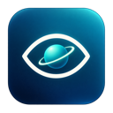
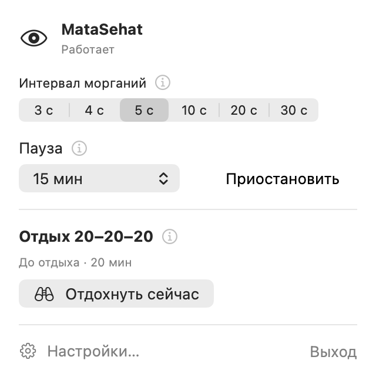

# MataSehat

**Напоминания о моргании и отдыхе для Mac.**

*Mata sehat* по-индонезийски — **«здоровые глаза»**.

`macOS 26.5+` · `Строка меню` · `Работает локально`

Когда работа затягивает, легко забыть моргать и отвести взгляд от экрана. MataSehat напоминает об этих простых привычках прямо во время работы.

  

## Что умеет

| | Как это помогает |
| :--- | :--- |
| 👁 **Напоминания о моргании** | Анимированный глаз или мягкое затемнение. Шесть интервалов от 3 до 30 секунд. |
| 🌿 **Отдых 20–20–20** | Каждые 20 минут — 20 секунд смотреть вдаль примерно на 6 метров. Отсчёт запускаешь сам; период и длительность можно изменить. |
| 🎛 **Настройки под тебя** | Положение и размер глаза, заметность и длительность сигналов. Звуки отдыха и автоматические напоминания можно выключить. |
| ⏸ **Пауза** | Приостанови напоминания на выбранное время или до ручного продолжения. |

Сигналы моргания пропускают нажатия и не забирают фокус. Настройки сохраняются между запусками; запуск при входе включается по желанию. Камера и аккаунт не нужны.

## Попробовать

Нужна **macOS 26.5 или новее**. Готовая сборка для Apple Silicon и Intel доступна в [Releases](https://github.com/Samaan98/MataSehat/releases/latest).

Скачай ZIP, распакуй его и перенеси **MataSehat.app** в папку **«Программы»**.

Сборка пока без подписи Developer ID и проверки Apple (notarization). Если macOS блокирует запуск, после попытки открытия разреши его в **«Системные настройки → Конфиденциальность и безопасность → Всё равно открыть»**. [Инструкция Apple](https://support.apple.com/en-us/102445).

При первом запуске откроются настройки. Выбери вид напоминания и удобный интервал — по умолчанию 5 секунд. Дальше управление доступно через значок глаза в строке меню, а кнопки `i` объясняют каждую функцию.

---

[Сборка и разработка](docs/development.md) · [Результаты проверок](docs/manual-verification.md)
