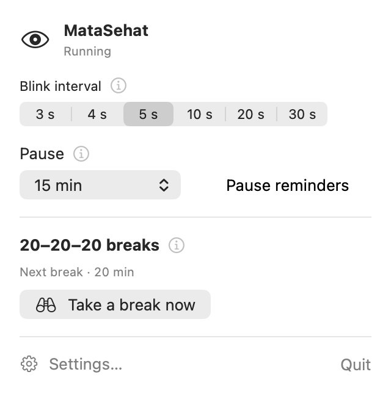

# MataSehat

**Free blink reminders and screen breaks for Mac.**

*Mata sehat* means **“healthy eyes”** in Indonesian.

`macOS 26.0+` · `Menu bar app` · `Works locally`

**English** · [Русский](README.ru.md)

When you are focused on your screen, it is easy to forget to blink or look away. MataSehat brings these simple habits back into your working day.

  

## What it does

| Feature | How it works |
| :--- | :--- |
| 👁 **Blink reminders** | An animated eye or gentle dimming. Six intervals from 3 to 30 seconds. |
| 🌿 **20–20–20 breaks** | Every 20 minutes, look at something about 20 feet (6 metres) away for 20 seconds. Start the countdown yourself; adjust the interval and duration to suit you. |
| 🎛 **Make it comfortable** | Choose the eye’s position and size, reminder visibility and duration. Turn break sounds and automatic invitations on or off. |
| ⏸ **Pause** | Pause reminders for a set time or until you resume them. |

Blink overlays let clicks through and keep your work in focus. Settings are saved between launches, and launch at login is optional. No camera or account required. The interface supports English and Russian, following your preferred macOS app language.

## Try it

Requires **macOS 26.0 or later**. Download the universal build for Apple Silicon and Intel from [Releases](https://github.com/Samaan98/MataSehat/releases/latest).

Unzip the download and move **MataSehat.app** to **Applications**.

The current release is not Developer ID signed or notarized. If macOS blocks it, try opening the app, then allow it under **System Settings → Privacy & Security → Open Anyway**. [Apple’s instructions](https://support.apple.com/en-us/102445).

Settings open on your first launch. Choose a reminder style and interval — the default is 5 seconds. After that, use the eye icon in the menu bar; the `i` buttons explain each feature.

---

[Build and development guide (Russian)](docs/development.md) · [Verification notes (Russian)](docs/manual-verification.md)
